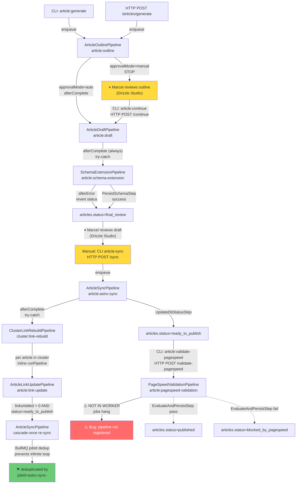

# Pre-Phase-4 System Audit
**Date:** 2026-05-06  
**Auditor:** Claude Code (automated, code-grounded)  
**Purpose:** Ground-truth inventory of the implemented system before designing Phase 4 (Web App specs 30+).  
**Methodology:** All claims verified against actual `.ts` files, `package.json` scripts, and live DB queries. Spec documents were consulted only as reference, not as truth.

---

## Table of Contents
1. [Executive Summary](#1-executive-summary)
2. [Adapter Inventory](#2-adapter-inventory)
3. [Pipeline Inventory](#3-pipeline-inventory)
4. [CLI Command Inventory](#4-cli-command-inventory)
5. [HTTP Endpoint Inventory](#5-http-endpoint-inventory)
6. [Database Schema Snapshot](#6-database-schema-snapshot)
7. [Auto-Cascade Map](#7-auto-cascade-map)
8. [Setup & Onboarding Requirements](#8-setup--onboarding-requirements)
9. [Skills Library Status](#9-skills-library-status)
10. [Cost Tracker Coverage](#10-cost-tracker-coverage)
11. [Audit Table Quality Check](#11-audit-table-quality-check)
12. [TypeScript Strictness Audit](#12-typescript-strictness-audit)
13. [Test Coverage Snapshot](#13-test-coverage-snapshot)
14. [Architectural Patterns That Hold Across Specs](#14-architectural-patterns-that-hold-across-specs)
15. [Phase-4-Relevant Gaps](#15-phase-4-relevant-gaps)
16. [Mode-Awareness Implications](#16-mode-awareness-implications)
17. [Recommendations for Phase 4 Sequencing](#17-recommendations-for-phase-4-sequencing)
18. [Issues Found During Audit](#18-issues-found-during-audit)

---

## 1. Executive Summary

### Feature Surface

| Category | Count | Notes |
|---|---|---|
| Adapter packages | 7 | anthropic, replicate, dataforseo, email, astro-sync, pagespeed, storage |
| Pipeline classes | 15 | 8 cold-start, 2 article, 1 astro-sync, 1 schema-extension, 2 internal-linking, 1 pagespeed |
| CLI commands | 16 | in `apps/api/package.json` + 3 in adapter packages |
| HTTP endpoints | 9 | 4 auth, 1 health, 4 article actions |
| DB tables | 20 | see Section 6 |
| DB enums | 11 | see Section 6 |
| Skills in library | 41 | all referenced skills exist |

### End-to-End Workflows

The following workflows are **fully implemented** (all steps coded, tested, registered in worker):

| Workflow | Status | Verified By |
|---|---|---|
| Cold-Start Voice Refinement (questions + synthesize) | ✅ Working | CLI script + pipeline code |
| Cold-Start Competitor Analysis (questions + analyze) | ✅ Working | CLI script + pipeline code |
| Cold-Start Cluster Plan (propose + expand) | ✅ Working | CLI script + pipeline code |
| Cold-Start Cornerstone List | ✅ Working | CLI script + pipeline code |
| Cold-Start Go-Live Checklist | ✅ Working | CLI script + pipeline code |
| Article Generation (outline + draft, schema, linking) | ✅ Working | 9 completed pipeline_runs in DB |
| Astro Sync (GitHub commit + DB update) | ✅ Working | 1 succeeded astro_sync_run in DB |
| Magic-Link Auth (login → verify → session) | ✅ Working | auth routes + middleware |
| Article Schema Extension | ✅ Working | registered in worker |
| Cluster Link Rebuild | ✅ Working | registered in worker |
| PageSpeed Validation | ⚠️ Partially | pipeline coded but **NOT registered in worker** — jobs hang |

### What Marcel Can Do Via CLI Today

```
# Tenant onboarding
bun --filter @marketing-auto/api add-project
bun --filter @marketing-auto/api sync-context <slug>

# Cold-start (run once per tenant, in order)
bun --filter @marketing-auto/api cold-start:voice-refinement <slug> questions
# (fill in answers to generated questions file)
bun --filter @marketing-auto/api cold-start:voice-refinement <slug> synthesize
bun --filter @marketing-auto/api cold-start:competitor-analysis <slug> questions
# (confirm competitor list in file)
bun --filter @marketing-auto/api cold-start:competitor-analysis <slug> analyze
bun --filter @marketing-auto/api cold-start:cluster-plan <slug> propose
# (review and edit cluster candidates file)
bun --filter @marketing-auto/api cold-start:cluster-plan <slug> expand
bun --filter @marketing-auto/api cold-start:cornerstone-list <slug>
bun --filter @marketing-auto/api cold-start:go-live-checklist <slug>

# Article production
bun --filter @marketing-auto/api article:generate <slug> <cornerstone-keyword>
# (review outline in Drizzle Studio or DB)
bun --filter @marketing-auto/api article:continue <articleId>
# (review draft — currently requires Drizzle Studio)
bun --filter @marketing-auto/api article:sync <articleId>
bun --filter @marketing-auto/api article:validate-pagespeed <articleId>

# Maintenance
bun --filter @marketing-auto/api cluster:rebuild-links <clusterId>
bun --filter @marketing-auto/api article:extend-schema <articleId>
```

### Top Architectural Strengths

1. **Every pipeline has a dedicated audit table.** `pipeline_runs` tracks all execution; `astro_sync_runs`, `pagespeed_runs`, `schema_extension_runs`, `link_rebuild_runs` each track their specialist domain with rich diagnostic fields (`errorStage`, `outcome`, `filesCommitted`, etc.).
2. **Cost tracking is pervasive.** Every LLM call, image generation, and SEO API call passes through `track()` before hitting the external API. No bypass possible by design (adapters wrap the call).
3. **Auto-cascade chain is complete.** Draft → SchemaExtension → (manual) Sync → LinkRebuild → (auto re-sync on modified articles) forms a coherent post-production pipeline with graceful error handling at each junction.
4. **Prompt caching is first-class.** `adapter-anthropic` splits every call into `systemPrefix` (cached, 1h TTL) and `systemSuffix` (variable). Cache hit/miss is logged on every call.
5. **All env vars are Zod-validated at startup.** `optionalStr()` prevents empty-string format failures. Invalid config fails fast with a readable error list — no silent degraded state.

### Top Gaps for Phase 4

1. **No real-time pipeline status.** Marcel has no way to know if a job is running, stuck, or done without querying the DB directly (Drizzle Studio). BullMQ progress events exist but nothing consumes them.
2. **PageSpeedValidationPipeline is not registered in the BullMQ worker.** Jobs enqueued via `article:validate-pagespeed` CLI or HTTP endpoint will sit in the queue indefinitely without error. (See Section 18.)
3. **No frontend at all.** Zero Quasar/Vue code exists. Every user action requires CLI or Drizzle Studio.
4. **Article review is DB-only.** Approving an outline or reviewing a draft requires direct DB manipulation. There is no approval UI.
5. **`linking` article status is defined in the enum but never set.** The status machine has an orphaned value that will confuse UI logic if not addressed.

### Deployment Posture

**Local-only today.** The system runs as a Bun process pointing at a Dockerized PostgreSQL + Redis. GitHub App private key is read from the filesystem. The `APP_BASE_URL` defaults to `http://localhost:3000`. No production deployment, no containerized API, no external ingress. Self-hosted mode (where private keys live in the credential vault, Chrome runs headless in Docker, and `APP_BASE_URL` is a real domain) has been designed in the schema and config but has no implementation yet.

---

## 2. Adapter Inventory

### 2.1 `@marketing-auto/adapter-anthropic`

**Version:** 0.1.0  
**Purpose:** Wraps `@anthropic-ai/sdk` messages API with prompt caching, cost tracking, JSON mode, and web search tool support.  
**External dependency:** Anthropic Messages API (`claude-haiku-4-5-20251001`, `claude-sonnet-4-6`, `claude-opus-4-7`)

**Required env vars:**

| Var | Required | Notes |
|---|---|---|
| `ANTHROPIC_API_KEY` | Required | Must start with `sk-ant-` |

**External setup:** Create Anthropic account, generate API key at console.anthropic.com.

**Cost model:**

| Model | Input (€/MTok) | Output (€/MTok) | Cache Read | Cache Write |
|---|---|---|---|---|
| claude-haiku-4-5 | 0.92 | 4.60 | 0.092 | 1.15 |
| claude-sonnet-4-6 | 2.76 | 13.80 | 0.276 | 3.45 |
| claude-opus-4-7 | 4.60 | 23.00 | 0.46 | 5.75 |

(All USD→EUR at `EUR_PER_USD = 0.92`)  
Costs logged to `cost_logs` via `track()` with per-call `metadata` including model, token counts, cache stats.

**Fail modes:**
- `ANTHROPIC_API_KEY` not set → throws `Error("ANTHROPIC_API_KEY is not set")`
- HTTP 4xx (non-429) → throws `AnthropicClientError` (not retried)
- HTTP 429 / 408 / 5xx → BullMQ retries (max 3 attempts, exponential backoff 5s/10s/20s)
- JSON parse failure in `jsonMode: true` → throws `JsonParseError` with raw response

**Verify commands:** None in package scripts. Test: `bun --filter @marketing-auto/adapter-anthropic test` (unit tests only, no live call).

**Mode-awareness:** None. Identical in lokal and self-hosted.

---

### 2.2 `@marketing-auto/adapter-replicate`

**Version:** 0.1.0  
**Purpose:** Generates images via Replicate API, downloads the output, uploads to Cloudflare R2, returns public URL.  
**External dependencies:** Replicate Predictions API; Cloudflare R2 (via `adapter-storage`)

**Required env vars:**

| Var | Required | Notes |
|---|---|---|
| `REPLICATE_API_TOKEN` | Required | Must start with `r8_` |
| `R2_ACCOUNT_ID` | Required (transitive) | via adapter-storage |
| `R2_ACCESS_KEY_ID` | Required (transitive) | |
| `R2_SECRET_ACCESS_KEY` | Required (transitive) | |
| `R2_BUCKET` | Required (transitive) | |
| `R2_PUBLIC_BASE_URL` | Optional | Falls back to `pub-<account>.r2.dev` |

**Models supported:**

| Model key | Replicate slug | Cost/image (EUR) |
|---|---|---|
| `flux-1.1-pro` | `black-forest-labs/flux-1.1-pro` | €0.0368 |
| `flux-schnell` | `black-forest-labs/flux-schnell` | €0.00276 |
| `ideogram-v3` | `ideogram-ai/ideogram-v3` | €0.0368 |

(Note: `flux-2-pro` is in the pricing table but NOT in `REPLICATE_MODELS` — cannot be used from article pipeline.)

**Fail modes:**
- Token not set → `Error("REPLICATE_API_TOKEN is not set")`
- Prediction `failed`/`canceled` → `ReplicateGenerationError`
- Unexpected status → `ReplicateGenerationError`
- Download failure → `ReplicateGenerationError`
- R2 upload failure → propagates from `putObject`

**Verify commands:** `bun --filter @marketing-auto/adapter-replicate test` (unit; no live call without token).

**Mode-awareness:** None. R2 bucket URL may differ between environments but is configured via env var.

---

### 2.3 `@marketing-auto/adapter-dataforseo`

**Version:** 0.1.0  
**Purpose:** Wraps DataForSEO SERP API (live organic) and Labs API (keyword overview, related keywords, ranked keywords).  
**External dependency:** DataForSEO REST API (Basic Auth)

**Required env vars:**

| Var | Required | Notes |
|---|---|---|
| `DATAFORSEO_LOGIN` | Required | Account email |
| `DATAFORSEO_PASSWORD` | Required | Account password |

**External setup:** Create DataForSEO account at dataforseo.com. Top up credit balance (pay-per-use). Default location: Germany (2276), language: `de`.

**Operations and cost:**

| Operation | Cost (EUR) | Used by |
|---|---|---|
| SERP live (1 page) | €0.00184 | ResearchStep |
| Keyword overview live (per 700 kws) | €0.01849 | ResearchStep, CompetitorAnalysis |
| Related keywords live | €0.01104 | ResearchStep |
| Ranked keywords live | €0.01104 | CompetitorAnalysis |

Actual cost is read from the API response `task.cost` field first; pricing table is the fallback.

**Fail modes:**
- Credentials not set → `DataForSeoError("DATAFORSEO_LOGIN and DATAFORSEO_PASSWORD must be set")`
- API `status_code !== 20000` → `DataForSeoError`
- Empty task results → `DataForSeoError`
- `standard` (queued) mode requested → immediate `DataForSeoError` (not implemented, use `live` only)

**Verify commands:** `bun --filter @marketing-auto/adapter-dataforseo test` (unit; mocked).

**Mode-awareness:** None.

---

### 2.4 `@marketing-auto/adapter-email`

**Version:** 0.1.0  
**Purpose:** Transactional email via Nodemailer + SMTP (Gmail). Sends magic-link auth emails.  
**External dependency:** Gmail SMTP (`smtp.gmail.com:465`)

**Required env vars:**

| Var | Required | Default | Notes |
|---|---|---|---|
| `SMTP_USER` | Optional | — | Gmail address. Without this, emails are console-logged (dev fallback). |
| `SMTP_APP_PASSWORD` | Optional | — | Gmail App Password (not account password) |
| `SMTP_FROM_NAME` | Optional | `Marketing Automation` | Display name |
| `SMTP_HOST` | Optional | `smtp.gmail.com` | |
| `SMTP_PORT` | Optional | `465` | |

**External setup:** Enable 2FA on Gmail → Generate App Password in Google Account → Security → 2-Step Verification → App Passwords.

**Cost model:** €0 per email (Gmail free tier). A `cost_logs` row is still written with `cost_eur = 0` for observability (count how many auth emails went out).  
Platform-level emails (auth) use `PLATFORM_PROJECT_ID = "00000000-0000-0000-0000-000000000001"`.

**Fail modes:**
- SMTP not configured → `delivered: false`, email content logged to console (not an error — graceful dev fallback)
- SMTP send failure → throws `EmailError` wrapping Nodemailer error

**Verify commands:** None. Test: `bun --filter @marketing-auto/adapter-email test`.

**Mode-awareness:** None functionally. In self-hosted mode, `APP_BASE_URL` in the magic-link verify URL must be the production domain (configured via env var).

---

### 2.5 `@marketing-auto/adapter-astro-sync`

**Version:** 0.1.0  
**Purpose:** Syncs a generated article (MDX + hero image) to a GitHub-hosted Astro repo via GitHub App authentication. Triggers cluster link rebuild after each successful sync.  
**External dependencies:** GitHub REST API (via Octokit), GitHub Apps (installation tokens)

**Required env vars:**

| Var | Required | Notes |
|---|---|---|
| `GITHUB_APP_ID` | Required | Numeric string, e.g. `"123456"` |
| `GITHUB_APP_PRIVATE_KEY_PATH` | Required | Filesystem path to `.pem` file |

**Required external setup:**
1. Create GitHub App at github.com/settings/apps/new
2. Set permissions: Contents (read/write), Metadata (read)
3. Download private key → save as `.pem` file
4. Note the App ID
5. Install the App on the target Astro repo
6. Get the installation ID: `bun --filter @marketing-auto/adapter-astro-sync list-installations`
7. Store `installationId` in `projects.astroRepo` JSON column (via `add-project` or DB update)

**Per-project config required** (in `projects.astroRepo` JSONB column):
```ts
{
  owner: string;        // GitHub org/user
  name: string;         // Repo name
  installationId: number;
  defaultBranch: string;
  contentRoot: string;  // e.g. "src/content/blog"
  assetsRoot: string;   // e.g. "src/assets/blog"
}
```

**Cost model:** €0 (GitHub API is free for committed content).

**Fail modes:**
- `GITHUB_APP_ID` or `GITHUB_APP_PRIVATE_KEY_PATH` not set → `AstroSyncError` (stage: `auth`)
- Private key file not readable → `AstroSyncError` (stage: `auth`)
- Article status wrong (not `final_review` or `ready_to_publish`) → throws before enqueueing
- `projects.astroRepo` null → fails in `LoadArticleStep`

**Verify commands:**
- `bun --filter @marketing-auto/adapter-astro-sync verify-app` — checks GitHub App authentication
- `bun --filter @marketing-auto/adapter-astro-sync list-installations` — lists all installed repos with their `installationId`

**Mode-awareness:**
- **Lokal:** Private key on filesystem path (readable by Bun process).
- **Self-hosted:** Private key should live in credential vault (encrypted in DB), loaded at runtime. No code for this yet — `GITHUB_APP_PRIVATE_KEY_PATH` env var is the only mechanism today.

---

### 2.6 `@marketing-auto/adapter-pagespeed`

**Version:** 0.1.0  
**Purpose:** Validates a synced article's PageSpeed scores by: cloning the Astro repo locally, running `astro build`, serving with `astro preview`, running Lighthouse headlessly via `puppeteer-core`, evaluating scores against per-project thresholds.  
**External dependencies:** Lighthouse 12, Puppeteer Core, `@puppeteer/browsers` (Chrome download), Node.js `child_process` (for `astro preview` subprocess)

**Required env vars:**

| Var | Required | Default | Notes |
|---|---|---|---|
| `PAGESPEED_WORK_DIR` | Optional | `/tmp/marketing-auto/pagespeed` | Clone destination |
| `PAGESPEED_BUILD_TIMEOUT_MS` | Optional | `300000` (5 min) | Astro build timeout |
| `PAGESPEED_LIGHTHOUSE_TIMEOUT_MS` | Optional | `120000` (2 min) | Lighthouse timeout |

Also requires `GITHUB_APP_ID` + `GITHUB_APP_PRIVATE_KEY_PATH` for cloning.

**Required external setup:**
- Chrome: `bun --filter @marketing-auto/adapter-pagespeed install-chrome` — downloads a stable Chrome build via `@puppeteer/browsers` to the default Puppeteer cache.

**Known limitations:**
- **Fixed port 14321** for `astro preview` — Astro does not support `--port 0` for dynamic binding. If port 14321 is in use, the pipeline fails.
- Preview server PID tracked in pipeline instance variable; killed in `afterComplete`/`afterError`.
- Clone happens to `PAGESPEED_WORK_DIR/<repoOwner>-<repoName>/` — reused across runs (git pull if exists).

**Cost model:** €0 (all local tooling, no external APIs called).

**Fail modes (by stage):**
- `load`: Article not found or wrong status
- `clone`: Git clone/pull fails (bad credentials or repo doesn't exist)
- `build`: `astro build` exits non-zero or times out
- `preview`: Server does not start within 30s or port 14321 in use
- `lighthouse`: Lighthouse fails or times out
- `evaluate`: DB update fails (unlikely)

**Verify commands:** `bun --filter @marketing-auto/adapter-pagespeed install-chrome`

**Mode-awareness:**
- **Lokal:** Chrome installed locally, Astro repo cloned to filesystem, preview server runs on host network.
- **Self-hosted:** Chrome must be pre-installed in Docker image (headless); clone directory needs a persistent volume; port 14321 must be available inside the container. No implementation yet.

---

### 2.7 `@marketing-auto/adapter-storage`

**Version:** 0.1.0  
**Purpose:** Wraps Bun's built-in `S3Client` for Cloudflare R2 object storage. Provides `putObject`, `objectExists`, `getFile`, `deleteObject`, `presignedUrl`.  
**External dependency:** Cloudflare R2 (S3-compatible API)

**Required env vars:**

| Var | Required | Notes |
|---|---|---|
| `R2_ACCOUNT_ID` | Required | Cloudflare account ID |
| `R2_ACCESS_KEY_ID` | Required | R2 API token key |
| `R2_SECRET_ACCESS_KEY` | Required | R2 API token secret |
| `R2_BUCKET` | Required | Bucket name |
| `R2_PUBLIC_BASE_URL` | Optional | Custom domain. Falls back to `https://pub-<account>.r2.dev/<key>` |

**External setup:**
1. Cloudflare dashboard → R2 → Create bucket
2. Manage R2 API Tokens → Create token with Object Read & Write permissions
3. (Optional) Add custom domain to bucket for public access
4. Enable public access on bucket if using `pub-<account>.r2.dev`

**Cost model:** No per-call cost tracking (storage is not in `costServiceEnum`). Costs incurred are: R2 storage ($0.015/GB/month) + egress (free within Cloudflare network, $0.09/GB egress to internet for `r2.dev` URLs).

**Fail modes:**
- Any R2 env var not set → `Error("R2 not configured. Set ...")`
- Write failure → propagates Bun S3Client error

**Verify commands:** `bun --filter @marketing-auto/adapter-storage test` (unit; requires live R2 credentials if not mocked).

**Mode-awareness:** None. Same S3 endpoint regardless of mode.

---

## 3. Pipeline Inventory

### 3.1 `cold-start:voice-refinement-questions`

**Class:** `VoiceRefinementQuestionsPipeline` — `packages/pipelines/src/cold-start/01-voice-refinement/pipeline.ts`  
**Purpose:** Reads the project's existing `marketingContextMd` and generates 8–15 targeted brand-voice questions for Marcel to answer.

**Trigger paths:** CLI only — `cold-start:voice-refinement <slug> questions`  
**Input schema:** `{ projectSlug: string, existingContextMd: string }`  
**Steps:**

| # | Step | Purpose |
|---|---|---|
| 1 | `generate-voice-questions` | LLM (sonnet-4-6, JSON mode) generates structured question list |

**Output:** `{ questions: Array<{ id, category, question, why_it_matters, suggested_starter }> }`  
Output is written to disk at `cold-start/<slug>/01-voice-refinement.md`.  
**Auto-cascade:** None.  
**Audit table:** `pipeline_runs` (via `runPipeline` — cold-start pipelines run synchronously, not via BullMQ).  
**Pause-points:** Full stop. Marcel must fill in answers before running `synthesize`.  
**Cost estimate:** ~€0.08–0.12 (1 sonnet-4-6 call, ~4K output tokens).  
**Status transitions:** None on `articles`.

---

### 3.2 `cold-start:voice-synthesis`

**Class:** `VoiceSynthesisPipeline` — same file as 3.1  
**Purpose:** Reads Marcel's answered questions alongside the existing marketing context and produces an updated `marketingContextMd`.

**Trigger paths:** CLI only — `cold-start:voice-refinement <slug> synthesize`  
**Input schema:** `{ projectSlug, existingContextMd, answeredQuestionsMd }`  
**Steps:**

| # | Step | Purpose |
|---|---|---|
| 1 | `synthesize-voice-context` | LLM synthesizes updated marketing context markdown |

**Output:** `{ updatedMarketingContextMd: string, changesSummary: string[] }`  
Written back to disk and to `projects.marketingContextMd` in DB.  
**Auto-cascade:** None.  
**Cost estimate:** ~€0.10–0.18 (1 sonnet-4-6 call with large context).

---

### 3.3 `cold-start:competitor-questions`

**Class:** `CompetitorQuestionsPipeline` — `packages/pipelines/src/cold-start/02-competitor-analysis/pipeline.ts`  
**Purpose:** Uses LLM + optional web search to identify competitor sites and generate review questions for Marcel to confirm.

**Trigger paths:** CLI — `cold-start:competitor-analysis <slug> questions`  
**Input schema:** `{ projectSlug: string }`  
**Steps:**

| # | Step | Purpose |
|---|---|---|
| 1 | `identify-competitors` | LLM (sonnet-4-6 + web_search tool) proposes competitor list + review questions |

**Output:** `{ competitors: Array<{url, name, why}>, review_questions: Array<{id, question, why_it_matters}> }`  
Written to `cold-start/<slug>/02-competitor-analysis.md`.  
**Pause-points:** Marcel confirms/edits the competitor list before `analyze` phase.  
**Cost estimate:** ~€0.15–0.30 (1 sonnet-4-6 call with web search tool enabled).

---

### 3.4 `cold-start:competitor-analysis`

**Class:** `CompetitorAnalysisPipeline` — same file as 3.3  
**Purpose:** Fetches real keyword rankings for each confirmed competitor via DataForSEO, then synthesizes a content gap report.

**Trigger paths:** CLI — `cold-start:competitor-analysis <slug> analyze`  
**Input schema:** `{ projectSlug, confirmedCompetitors: Array<{url, name, why}> }`  
**Steps:**

| # | Step | Purpose |
|---|---|---|
| 1 | `fetch-competitor-keywords` | DataForSEO rankedKeywords per competitor domain |
| 2 | `synthesize-competitor-report` | LLM synthesizes gap analysis from keyword data |

**Cost estimate:** ~€0.05–0.20 DataForSEO (per competitor) + ~€0.10 LLM = €0.15–0.50 total depending on number of competitors.

---

### 3.5 `cold-start:cluster-propose`

**Class:** `ClusterProposePipeline` — `packages/pipelines/src/cold-start/03-cluster-plan/pipeline.ts`  
**Purpose:** Generates topical cluster candidates, validates keyword volumes via DataForSEO.

**Trigger paths:** CLI — `cold-start:cluster-plan <slug> propose`  
**Input schema:** `{ projectSlug, contentGaps: string[], topicsToAvoid: string[] }`  
**Steps:**

| # | Step | Purpose |
|---|---|---|
| 1 | `generate-cluster-candidates` | LLM proposes cluster topics |
| 2 | `validate-keywords` | DataForSEO keyword overview validates search volumes |

**Pause-points:** Marcel reviews and edits the proposed clusters file before `expand`.

---

### 3.6 `cold-start:cluster-expand`

**Class:** `ClusterExpandPipeline` — same file as 3.5  
**Purpose:** For each confirmed cluster, fetches satellite keywords and writes cluster + content-pillar rows to DB.

**Trigger paths:** CLI — `cold-start:cluster-plan <slug> expand`  
**Steps:**

| # | Step | Purpose |
|---|---|---|
| 1 | `expand-with-satellites` | DataForSEO relatedKeywords per cluster |
| 2 | `synthesize-cluster-plan` | LLM finalizes cluster structure, writes to DB |

**DB side-effects:** Inserts rows in `content_pillars` and `clusters` (with `cornerstoneKeywords` + `satelliteKeywords`).

---

### 3.7 `cold-start:cornerstone-list`

**Class:** `CornerstoneListPipeline` — `packages/pipelines/src/cold-start/04-cornerstone-list/pipeline.ts`  
**Purpose:** For each confirmed cluster, generates a spec for 3–5 cornerstone articles (title, target keyword, angle, recommended length).

**Trigger paths:** CLI — `cold-start:cornerstone-list <slug>`  
**Steps:**

| # | Step | Purpose |
|---|---|---|
| 1 | `generate-cornerstone-specs` | LLM generates cornerstone article briefs per cluster |

**Output:** Written to `cold-start/<slug>/04-cornerstone-list.md`.

---

### 3.8 `cold-start:go-live-checklist`

**Class:** `GoLiveChecklistPipeline` — `packages/pipelines/src/cold-start/05-go-live-checklist/pipeline.ts`  
**Purpose:** Generates a project-specific go-live checklist based on the completed cold-start data.

**Trigger paths:** CLI — `cold-start:go-live-checklist <slug>`  
**Steps:**

| # | Step | Purpose |
|---|---|---|
| 1 | `generate-go-live-checklist` | LLM generates checklist from full cold-start context |

---

### 3.9 `article:outline` (Job 1)

**Class:** `ArticleOutlinePipeline` — `packages/pipelines/src/article/pipeline.ts`  
**Purpose:** Researches a cornerstone keyword and produces a detailed article outline (sections, hero image prompt, meta description).

**Trigger paths:**
- CLI: `article:generate <slug> <cornerstoneKeyword>`
- HTTP: `POST /api/projects/:slug/articles/generate`

**Input schema:** `{ articleId: uuid, projectId: uuid, modelOverride?: string }`  
**Steps:**

| # | Step | Skills used | Purpose |
|---|---|---|---|
| 1 | `topic-intake` | — | Reads article + cluster + project from DB; extracts cornerstoneKeyword, satelliteKeywords, approvalMode |
| 2 | `research` | `ai-seo`, `content-strategy` | DataForSEO SERP + keyword overview + related keywords for cornerstoneKeyword |
| 3 | `outline` | `copywriting`, `content-strategy`, `ai-seo`, `schema-markup` | LLM produces structured `ArticleOutline` JSON |
| 4 | `persist-outline` | — | Writes outline to DB, sets status → `outline_review` |

**Output schema:** `{ articleId: uuid, nextAction: "wait_for_review" | "auto_continue" }`  
**Auto-cascade:** If `approvalMode = "auto"` → `afterComplete` enqueues `article:draft` immediately.  
**Audit table:** `pipeline_runs` (registered in BullMQ worker ✅)  
**Pause-points:** In `manual` mode, Marcel reviews the outline before `article:continue`.  
**Status transitions:** `generating` → `outline_review`  
**Cost estimate:** ~€0.20–0.30 (DataForSEO: ~€0.05, LLM outline: ~€0.08 with cache)

---

### 3.10 `article:draft` (Job 2)

**Class:** `ArticleDraftPipeline` — `packages/pipelines/src/article/pipeline.ts`  
**Purpose:** Writes the full article body, runs self-review, generates hero image, assembles JSON-LD, persists everything.

**Trigger paths:**
- CLI: `article:continue <articleId>`
- HTTP: `POST /api/articles/:articleId/continue`
- Auto: `article:outline` afterComplete (if approvalMode = "auto")

**Input schema:** `{ articleId: uuid, projectId: uuid, modelOverride?: string }`  
**Steps:**

| # | Step | Skills used | Purpose |
|---|---|---|---|
| 1 | `topic-intake` | — | Re-loads article context from DB (same as outline job) |
| 2 | `draft` | `copywriting`, `copy-editing`, `ai-seo`, `product-marketing-context` | LLM writes full article (2000–4000 words), streams output |
| 3 | `self-review` | `copy-editing`, `product-marketing-context` | LLM reviews draft for quality issues, scores 0–100 |
| 4 | `hero-image` | — | Replicate `flux-1.1-pro` generates hero image → R2 |
| 5 | `assembly` | — | Builds Article JSON-LD schema.org object |
| 6 | `persist-article` | — | Writes bodyMd, hero URLs, self-review, schema to DB |

**Output schema:** `{ articleId: uuid, wordCount: number, selfReviewScore: number }`  
**Auto-cascade:** `afterComplete` → `enqueueSchemaExtension` (always, wrapped in try-catch).  
**Audit table:** `pipeline_runs` (registered in BullMQ worker ✅)  
**Pause-points:** Status lands at `final_review` — Marcel reviews before syncing.  
**Status transitions:** `drafting` → `final_review`  
**Cost estimate:** ~€0.40–0.60 (Draft LLM: ~€0.25, Self-review: ~€0.12, Hero image: €0.037, Assembly: ~€0.03)

---

### 3.11 `article:schema-extension`

**Class:** `SchemaExtensionPipeline` — `packages/pipelines/src/schema-extension/pipeline.ts`  
**Purpose:** Detects if the article body contains FAQ or HowTo content; if so, generates additional JSON-LD objects and appends them to `schemaJsonLd` array.

**Trigger paths:** Auto only — enqueued by `article:draft` afterComplete.  
Also via CLI: `article:extend-schema <articleId>` (manual re-run).  
Also via HTTP: not directly wired (only CLI script and auto-trigger).

**Input schema:** `{ articleId: uuid, projectId: uuid }`  
**Steps:**

| # | Step | Skills used | Purpose |
|---|---|---|---|
| 1 | `load-article` | — | Reads article + project + cluster from DB |
| 2 | `detect-rich-types` | `schema-markup`, `ai-seo` | LLM detects FAQ/HowTo patterns in body |
| 3 | `build-jsonld` | — | Constructs FAQPage and/or HowTo JSON-LD objects |
| 4 | `persist-schema` | — | Writes array of JSON-LD to `articles.schemaJsonLd`, sets status |

**Output schema:** `{ articleId: uuid, schemaCount: number, schemaExtensionRunId: uuid }`  
**Auto-cascade:** None.  
**afterError:** Reverts article status from `schema_extending` → `final_review` (graceful degradation — article can still be synced without rich types).  
**Audit table:** `schema_extension_runs` (registered in BullMQ worker ✅)  
**Status transitions:** `final_review` → `schema_extending` (trigger) → `final_review` (complete or error)  
**Cost estimate:** ~€0.05–0.10 (2 LLM calls: detection + build)

---

### 3.12 `article:astro-sync`

**Class:** `ArticleSyncPipeline` — `packages/adapters/astro-sync/src/pipeline.ts`  
**Purpose:** Renders the article to MDX, downloads hero image, commits both files to GitHub, updates DB with commit SHA and status.

**Trigger paths:**
- CLI: `article:sync <articleId>`
- HTTP: `POST /api/articles/:articleId/sync`

**Input schema:** `{ articleId: uuid, projectId: uuid }`  
**Steps:**

| # | Step | Purpose |
|---|---|---|
| 1 | `load-article` | Reads article + cluster + project + astroRepo config from DB |
| 2 | `resolve-schema` | Parses target Astro collection schema from GitHub (blog/glossar/etc.) |
| 3 | `download-hero` | Downloads hero image from R2 public URL, prepares base64 |
| 4 | `render-mdx` | Renders MDX file with frontmatter matching Astro collection schema |
| 5 | `commit-to-github` | Commits MDX + hero asset via GitHub API (installation token) |
| 6 | `update-db-status` | Sets `astroSyncedAt`, `astroCommitSha`, status → `ready_to_publish` |

**Output schema:** `{ articleId: uuid, syncRunId: uuid }`  
**Auto-cascade:** `afterComplete` → `enqueueClusterLinkRebuild` (if article has a `clusterId`).  
**Audit table:** `astro_sync_runs` (registered in BullMQ worker ✅)  
**Status transitions:** `final_review` / `ready_to_publish` → `ready_to_publish`  
**Cost estimate:** €0 (GitHub API free)

---

### 3.13 `cluster:link-rebuild`

**Class:** `ClusterLinkRebuildPipeline` — `packages/pipelines/src/internal-linking/pipeline.ts`  
**Purpose:** For every published/ready-to-publish article in a cluster, runs `ArticleLinkUpdatePipeline` inline to add internal links, then updates `link_rebuild_runs` audit row.

**Trigger paths:**
- Auto: `article:astro-sync` afterComplete
- CLI: `cluster:rebuild-links <clusterId>`

**Input schema:** `{ clusterId: uuid, projectId: uuid, triggeringArticleId: uuid | null, triggerType: enum, linkRebuildRunId?: uuid }`  
**Steps:**

| # | Step | Purpose |
|---|---|---|
| 1 | `orchestrate-cluster-rebuild` | Checks monthly budget, iterates cluster articles, runs `ArticleLinkUpdatePipeline` inline for each |

**Budget check:** Reads `projects.linkRebuildBudgetMonthly` (default €30/month); throws `InternalLinkingError(stage: "budget")` if exceeded.  
**Auto-cascade:** `afterComplete` updates `link_rebuild_runs` row to `succeeded`.  
**afterError:** Updates `link_rebuild_runs` to `failed` or `budget_exceeded`.  
**Audit table:** `link_rebuild_runs` (registered in BullMQ worker ✅)  
**BullMQ dedup:** `jobId = "link-rebuild-<clusterId>"` — concurrent sync triggers collapse to 1 job.  
**Status transitions on `articles`:** via `ArticleLinkUpdatePipeline` → `ready_to_publish` (reset before re-sync)  
**Cost estimate:** ~€0.30 per article in cluster (1 LLM call for link analysis each)

---

### 3.14 `article:link-update`

**Class:** `ArticleLinkUpdatePipeline` — `packages/pipelines/src/internal-linking/article-pipeline.ts`  
**Purpose:** Analyzes a single article for internal linking opportunities, applies suggestions, persists updated `bodyMd`, optionally enqueues re-sync.

**Trigger paths:** Inline only — called via `runPipeline()` inside `ClusterLinkRebuildPipeline`. NOT enqueued in BullMQ independently.  
**Steps:**

| # | Step | Skills | Purpose |
|---|---|---|---|
| 1 | `load-candidates` | — | Reads article body + all sibling article slugs/titles |
| 2 | `analyze-links` | `copywriting`, `ai-seo`, `content-strategy` | LLM suggests internal link insertions |
| 3 | `apply-links` | — | Deterministically inserts markdown links |
| 4 | `persist-and-resync` | — | Saves new bodyMd; if links added + article is ready_to_publish/published → enqueues `article:astro-sync` |

**Auto-cascade:** If links were added AND `triggerResync = true` AND article status is `ready_to_publish` or `published` → `enqueueArticleSync`. This creates a **cascade-once** re-sync (the re-synced article's `afterComplete` will again try `enqueueClusterLinkRebuild`, but BullMQ jobId dedup prevents infinite loops).

---

### 3.15 `article:pagespeed-validation`

**Class:** `PageSpeedValidationPipeline` — `packages/adapters/pagespeed/src/pipeline.ts`  
**Purpose:** Clones Astro repo, builds it, serves preview, runs Lighthouse, evaluates scores against project thresholds, persists result.

**Trigger paths:**
- CLI: `article:validate-pagespeed <articleId>`
- HTTP: `POST /api/articles/:articleId/validate-pagespeed`

**⚠️ CRITICAL:** This pipeline is **NOT registered in the BullMQ worker** (`apps/api/src/workers/index.ts`). Jobs enqueued via CLI or HTTP will sit in the queue indefinitely. See Section 18, Issue #1.

**Steps:**

| # | Step | Purpose |
|---|---|---|
| 1 | `load-article` | Reads article + project thresholds + astroRepo config |
| 2 | `clone-or-update` | git clone or git pull of Astro repo to `PAGESPEED_WORK_DIR` |
| 3 | `astro-build` | Runs `npm run build` in cloned repo |
| 4 | `preview-server` | Spawns `astro preview --port 14321`, waits for ready |
| 5 | `lighthouse` | Runs Lighthouse via Puppeteer Core against preview URL |
| 6 | `evaluate-and-persist` | Compares scores to thresholds; sets status → `published` or `blocked_by_pagespeed` |

**afterComplete/afterError:** Kill preview server process (SIGTERM then SIGKILL).  
**Audit table:** `pagespeed_runs`  
**Status transitions:** `validating` → `published` (pass) or `blocked_by_pagespeed` (fail)  
**Cost estimate:** €0 (all local tooling)  
**Known limitation:** Fixed port 14321. Port collision causes `preview` stage failure.

---

## 4. CLI Command Inventory

### Project Management

| Command | Args | What it does | Output |
|---|---|---|---|
| `add-project` | `<slug> <name> <industry> <template>` | Creates `projects` row in DB | DB insert |
| `add-user` | `<email> [name] [role]` | Creates `users` row in DB | DB insert |
| `sync-context` | `<slug>` | Reads `project-contexts/<slug>/marketing-context.md`, parses frontmatter, writes to `projects.marketingContextMd` | DB update |

### Cold-Start

| Command | Args | What it does | Pipeline triggered | Output |
|---|---|---|---|---|
| `cold-start:voice-refinement` | `<slug> [questions\|synthesize]` | questions: generates voice questions; synthesize: writes updated context | VoiceRefinementQuestionsPipeline / VoiceSynthesisPipeline | Disk file + DB update |
| `cold-start:competitor-analysis` | `<slug> [questions\|analyze]` | questions: identifies competitors; analyze: fetches keywords + gap analysis | CompetitorQuestionsPipeline / CompetitorAnalysisPipeline | Disk file |
| `cold-start:cluster-plan` | `<slug> [propose\|expand]` | propose: generates cluster candidates with volumes; expand: saves to DB with satellites | ClusterProposePipeline / ClusterExpandPipeline | Disk file + DB insert |
| `cold-start:cornerstone-list` | `<slug>` | Generates cornerstone article briefs per cluster | CornerstoneListPipeline | Disk file |
| `cold-start:go-live-checklist` | `<slug>` | Generates go-live checklist | GoLiveChecklistPipeline | Disk file |

### Article Production

| Command | Args | What it does | Pipeline triggered | Notes |
|---|---|---|---|---|
| `article:generate` | `<slug> <cornerstoneKeyword> [--auto] [--model opus\|sonnet]` | Creates article row, enqueues outline pipeline | ArticleOutlinePipeline (via BullMQ) | Worker must be running |
| `article:continue` | `<articleId> [--model opus\|sonnet]` | Enqueues draft pipeline for `outline_review` article | ArticleDraftPipeline (via BullMQ) | Worker must be running |
| `article:sync` | `<articleId>` | Enqueues Astro sync | ArticleSyncPipeline (via BullMQ) | Needs GitHub App configured |
| `article:validate-pagespeed` | `<articleId>` | Enqueues PageSpeed validation | PageSpeedValidationPipeline ⚠️ NOT IN WORKER | Bug — see Section 18 |
| `article:extend-schema` | `<articleId>` | Re-runs schema extension for `final_review` article | SchemaExtensionPipeline (via BullMQ) | |

### Cluster Maintenance

| Command | Args | What it does | Pipeline triggered | Notes |
|---|---|---|---|---|
| `cluster:rebuild-links` | `<clusterId>` | Enqueues link rebuild for all published articles in cluster | ClusterLinkRebuildPipeline (via BullMQ) | Budget-gated |

### Admin / Setup

| Command | Package | What it does |
|---|---|---|
| `list-installations` | `adapter-astro-sync` | Lists all GitHub App installations with repo names and installationIds |
| `verify-app` | `adapter-astro-sync` | Verifies GitHub App authentication is working |
| `install-chrome` | `adapter-pagespeed` | Downloads Chrome for Lighthouse via `@puppeteer/browsers` |

### Database

| Command | Package | What it does |
|---|---|---|
| `generate` | `db` | `drizzle-kit generate` — creates migration files from schema |
| `migrate` | `db` | Applies pending migrations to DB |
| `studio` | `db` | Opens Drizzle Studio (web-based DB browser) |
| `push` | `db` | `drizzle-kit push` (schema-push, dev-only) |
| `seed-platform` | `db` | Seeds platform project row (`id = PLATFORM_PROJECT_ID`) |

### Workers

| Command | Package | What it does |
|---|---|---|
| `worker` | `api` | Starts BullMQ workers (pipeline + scheduler) |
| `worker:dev` | `api` | Same with `--hot` reload |
| `dev` | `api` | Starts HTTP API server in dev mode |

### CLI Workflow Shapes

**New Tenant Onboarding:**
```
add-project → sync-context → cold-start:voice-refinement questions
  → (fill answers) → cold-start:voice-refinement synthesize
  → cold-start:competitor-analysis questions → (confirm competitors)
  → cold-start:competitor-analysis analyze
  → cold-start:cluster-plan propose → (review/edit clusters)
  → cold-start:cluster-plan expand
  → cold-start:cornerstone-list
  → cold-start:go-live-checklist
```

**First Article Production (manual approval mode):**
```
article:generate <slug> <keyword>
  → (worker runs outline pipeline)
  → (review outline in Drizzle Studio)
  → article:continue <articleId>
  → (worker runs draft + schema-extension pipelines)
  → (review draft in Drizzle Studio)
  → article:sync <articleId>
  → (worker runs astro-sync + auto-triggers cluster link rebuild)
  → article:validate-pagespeed <articleId>
  → (⚠️ currently broken — see Issue #1)
```

**First Article Production (auto-approval mode):**
```
article:generate <slug> <keyword> --auto
  → (worker: outline → auto-continue → draft → schema-extension)
  → (review final draft in Drizzle Studio)
  → article:sync → article:validate-pagespeed
```

**Cluster Maintenance:**
```
cluster:rebuild-links <clusterId>
  → (worker: per-article link analysis → apply → re-sync modified articles)
```

---

## 5. HTTP Endpoint Inventory

All routes registered in `apps/api/src/server.ts`. Auth middleware (`sessionLoader`) runs on all routes but does not block unauthenticated requests — individual routes check `c.get("user")` themselves.

| Method | Path | Purpose | Auth required | Triggers pipeline? | Status |
|---|---|---|---|---|---|
| `GET` | `/health` | Health check + uptime | No | No | **active** |
| `POST` | `/api/auth/login` | Send magic-link email | No | No | **active** |
| `GET` | `/api/auth/verify` | Validate token, create session, redirect | No | No | **active** |
| `POST` | `/api/auth/logout` | Delete session, clear cookie | No | No | **active** |
| `GET` | `/api/auth/me` | Return current user or 401 | Yes (session cookie) | No | **active** |
| `POST` | `/api/projects/:projectSlug/articles/generate` | Enqueue outline pipeline | No (⚠️ should require auth) | Yes — ArticleOutlinePipeline | **active** |
| `POST` | `/api/articles/:articleId/continue` | Enqueue draft pipeline | No (⚠️ should require auth) | Yes — ArticleDraftPipeline | **active** |
| `POST` | `/api/articles/:articleId/sync` | Enqueue Astro sync | No (⚠️ should require auth) | Yes — ArticleSyncPipeline | **active** |
| `POST` | `/api/articles/:articleId/validate-pagespeed` | Enqueue PageSpeed validation | No (⚠️ should require auth) | Yes — PageSpeedValidationPipeline ⚠️ | **active** (but worker bug) |

**Note on auth:** The four article action endpoints are currently unauthenticated. The server comment says "Protected routes (Spec 06+) will apply requireAuth middleware" — this is a Phase 4 task.

**Missing endpoints** (no routes exist yet):
- `GET /api/projects` — list projects
- `GET /api/projects/:slug` — project detail
- `GET /api/articles` — list articles (with status filter)
- `GET /api/articles/:id` — article detail
- `PATCH /api/articles/:id/approve` — approve outline
- `GET /api/pipeline-runs` — list runs
- `GET /api/cost-summary` — cost dashboard data
- All cold-start endpoints
- Credential management endpoints

---

## 6. Database Schema Snapshot

**Live DB tables (20):** confirmed via `information_schema` query.

### 6.1 `projects`

**Purpose:** Top-level tenant record. One row per content site.

| Column | Type | Notes |
|---|---|---|
| `id` | uuid PK | |
| `slug` | text UNIQUE | URL-safe identifier |
| `name` | text | |
| `domain` | text | Published domain (optional) |
| `industry` | `industryEnum` | |
| `lifecycleStage` | `lifecycleStageEnum` | default `cold_start` |
| `pipelineTemplate` | `pipelineTemplateEnum` | |
| `brandIdentity` | jsonb `BrandIdentity` | voice, tone, forbidden phrases, etc. |
| `targetAudience` | jsonb `TargetAudience` | primaryPersona, language, region |
| `cmsConfig` | jsonb `CmsConfig` | type, repoUrl, etc. |
| `monetizationConfig` | jsonb `MonetizationConfig` | adsense, affiliate, own products |
| `pipelineConfig` | jsonb `PipelineConfig` | word limits, frequency, approval mode |
| `costLimits` | jsonb `CostLimits` | daily/monthly limits per service |
| `marketingContextMd` | text | Full marketing context markdown |
| `marketingContextUpdatedAt` | timestamptz | |
| `astroRepo` | jsonb `AstroRepoConfig` | nullable; owner, name, installationId, etc. |
| `linkRebuildBudgetMonthly` | numeric(10,2) | default `"30.00"` EUR |
| `pagespeedThresholds` | jsonb `PagespeedThresholds` | default perf:85, a11y:90, bp:90, seo:95 |
| `createdAt` / `updatedAt` | timestamptz | |

**Indexes:** `projects_slug_idx` on `slug`

---

### 6.2 `project_credentials`

**Purpose:** Encrypted credential vault for per-project third-party credentials.

| Column | Type | Notes |
|---|---|---|
| `id` | uuid PK | |
| `projectId` | uuid FK → projects (cascade) | |
| `service` | `credentialServiceEnum` | |
| `encryptedPayload` | text | AES-256 encrypted JSON |
| `expiresAt` | timestamptz | nullable |
| `createdAt` / `updatedAt` | timestamptz | |

**Indexes:** unique `(projectId, service)`, `project_credentials_project_idx`

---

### 6.3 `brand_voices`

**Purpose:** Versioned brand voice system prompts produced by cold-start voice synthesis.

| Column | Type | Notes |
|---|---|---|
| `id` | uuid PK | |
| `projectId` | uuid FK → projects (cascade) | |
| `version` | integer | Incremented per synthesis run |
| `systemPrompt` | text | The LLM system prompt for this voice |
| `exampleParagraphs` | jsonb `string[]` | |
| `isActive` | boolean | Only one active per project |

**Indexes:** `brand_voices_project_idx`, `brand_voices_active_idx`

---

### 6.4 `content_pillars`

**Purpose:** Top-level topical categories (e.g. "KI-Tools", "Prompt Engineering") created during cold-start cluster plan.

| Column | Type | Notes |
|---|---|---|
| `id` | uuid PK | |
| `projectId` | uuid FK → projects (cascade) | |
| `name` | text | |
| `description` | text | |
| `position` | integer | Display ordering |

**Indexes:** `content_pillars_project_idx`

---

### 6.5 `clusters`

**Purpose:** Topical cluster — a group of related articles under one pillar. Contains all keyword data needed for article generation.

| Column | Type | Notes |
|---|---|---|
| `id` | uuid PK | |
| `projectId` | uuid FK → projects (cascade) | |
| `pillarId` | uuid FK → content_pillars (restrict) | |
| `name` | text | |
| `pillar` | text | Denormalized pillar name |
| `primaryKeyword` | text | |
| `cornerstoneKeywords` | jsonb `string[]` | Keywords this cluster owns |
| `satelliteKeywords` | jsonb `SatelliteKeywordEntry[]` | Per-cornerstone satellite data |
| `status` | text | default `"proposed"` |
| `pillarArticleId` | uuid | nullable, forward-compat |

**Indexes:** `clusters_project_idx`, `clusters_pillar_idx`

---

### 6.6 `articles`

**Purpose:** Central content entity. Populated incrementally by pipeline steps.

Key columns by lifecycle phase:

| Phase | Columns populated |
|---|---|
| Created | `slug`, `cornerstoneKeyword`, `clusterId`, `status`, `approvalMode` |
| After outline | `title`, `metaDescription`, `outline` (jsonb), `status = outline_review` |
| After draft | `bodyMd`, `wordCount`, `heroImageR2Key`, `heroImagePublicUrl`, `heroImageAltText`, `selfReviewIssues`, `selfReviewScore`, `schemaJsonLd[0]`, `status = final_review` |
| After schema-extension | `schemaJsonLd` (extended), `status = final_review` |
| After sync | `astroSyncedAt`, `astroCommitSha`, `astroFrontmatter`, `astroAssetPaths`, `status = ready_to_publish` |
| After link-update | `bodyMd` (modified), `internalLinksUpdatedAt`, `internalLinksAdded`, `internalLinkTargets` |
| After pagespeed | `pagespeedScores`, `pagespeedCoreWebVitals`, `pagespeedFailedThresholds`, `pagespeedValidatedAt`, `status = published OR blocked_by_pagespeed` |

**Special columns:**
- `embedding` vector(1024) — for internal linking candidate matching (HNSW index)
- `collectionType` text — default `"blog"`; forward-compat for `glossar`/`case_study`/`tool`
- `cornerstoneSpecId` uuid — nullable, for linking to cold-start cornerstone specs (no DB FK)

**Indexes:** project, cluster, `(projectId, status)`, cornerstone keyword, unique `(projectId, slug)`, HNSW embedding index

---

### 6.7 `article_versions`

**Purpose:** Immutable snapshots of article body at each significant change (not yet written by any pipeline — scaffolded for future use).

---

### 6.8 `social_posts`

**Purpose:** Social media repurposing content derived from articles. No pipeline steps create these yet.

---

### 6.9 `cost_logs`

**Purpose:** Per-API-call cost tracking. Written by `track()` wrapper in cost-tracker.

| Column | Type | Notes |
|---|---|---|
| `projectId` | uuid FK → projects (cascade) | |
| `service` | `costServiceEnum` | |
| `operation` | text | Free-form label, e.g. `"outline-generation"` |
| `costEur` | decimal(10,6) | |
| `metadata` | jsonb | Model, tokens, response details |
| `pipelineRunId` | uuid | Optional correlation (no FK) |
| `articleId` | uuid | Optional correlation (no FK) |

**Indexes:** `(projectId, service, createdAt)`, `(projectId, createdAt)`, `pipelineRunId`

---

### 6.10 `pipeline_runs`

**Purpose:** Audit trail for every pipeline and step execution.

| Column | Type | Notes |
|---|---|---|
| `pipelineName` | text | e.g. `"article:outline"` |
| `stepName` | text | null for parent run; step name for child run |
| `status` | `pipelineRunStatusEnum` | queued / running / completed / failed / cancelled |
| `jobId` | text | BullMQ job ID |
| `parentRunId` | uuid | Step runs point to parent pipeline run |
| `input` / `output` | jsonb | Full input/output snapshots |
| `errorMessage` | text | On failure |
| `startedAt` / `completedAt` | timestamptz | |

---

### 6.11 `astro_sync_runs`

**Purpose:** Tracks each Astro sync attempt with commit-level detail.

| Column | Type | Notes |
|---|---|---|
| `status` | text `"pending" \| "succeeded" \| "failed"` | |
| `commitSha` | text | Set on success |
| `errorStage` | text `"load" \| "schema" \| "image" \| "render" \| "commit" \| "db_update"` | |
| `filesCommitted` | jsonb `string[]` | |
| `bytesCommitted` | integer | |

---

### 6.12 `pagespeed_runs`

**Purpose:** Full Lighthouse audit results per article validation attempt.

| Key columns | Notes |
|---|---|
| `status` | `"pending" \| "succeeded" \| "failed" \| "errored"` |
| `outcome` | `"pass" \| "fail" \| "error" \| null` |
| `scores` | jsonb — performance, accessibility, bestPractices, seo (0–100) |
| `coreWebVitals` | jsonb — lcp, inp, cls |
| `thresholdsUsed` | jsonb — snapshot of thresholds at time of run |
| `failedCategories` | jsonb `string[]` |
| `errorStage` | `"clone" \| "build" \| "preview" \| "lighthouse" \| "evaluate"` |

---

### 6.13 `schema_extension_runs`

**Purpose:** Tracks each schema extension execution with detected type details.

| Key columns | Notes |
|---|---|
| `status` | `"pending" \| "succeeded" \| "failed"` |
| `detectedTypes` | jsonb `{ breadcrumb: bool, faq: bool, howto: bool }` |
| `faqQuestionCount` | integer |
| `howtoStepCount` | integer |
| `errorStage` | `"detect" \| "build" \| "persist"` |

---

### 6.14 `link_rebuild_runs`

**Purpose:** Tracks cluster-level link rebuild runs, including budget enforcement.

| Key columns | Notes |
|---|---|
| `status` | `"pending" \| "succeeded" \| "failed" \| "budget_exceeded"` |
| `triggerType` | `"auto_after_sync" \| "manual_cli" \| "manual_http"` |
| `articlesProcessed` / `articlesModified` / `totalLinksAdded` | Aggregate stats |
| `totalCostEur` | numeric(10,4) |
| `clusterId` | uuid (no FK — avoids circular dep) |
| `triggeringArticleId` | uuid (no FK) |

---

### 6.15 Auth Tables (`users`, `magic_link_tokens`, `sessions`)

- **`users`**: `id`, `email` (unique), `name`, `role` (`owner`/`editor`), `emailVerified`, `lastLoginAt`
- **`magic_link_tokens`**: `email`, `tokenHash` (SHA-256), `expiresAt` (15 min TTL), `consumedAt`
- **`sessions`**: `userId` FK → users (cascade), `tokenHash` (unique), `expiresAt` (30-day TTL), `userAgent`, `ipAddress`

---

### 6.16 Other Tables

- **`briefings`**: Reserved for daily editorial briefings — no pipeline writes to it yet.
- **`approvals`**: Tracks approval actions on articles/social posts — no pipeline reads this yet.
- **`push_subscriptions`**: Web Push VAPID subscriptions — VAPID keys defined in env schema but no push code exists.

---

### Enum Summary

| Enum | Values |
|---|---|
| `articleStatusEnum` | `proposed`, `approved`, `generating`, `outline_review`, `drafting`, `final_review`, `schema_extending`, `linking`*, `ready_to_publish`, `validating`, `published`, `blocked_by_pagespeed`, `failed`, `rejected` (14 values) |
| `lifecycleStageEnum` | `cold_start`, `pre_launch`, `launch`, `growth`, `mature` |
| `pipelineTemplateEnum` | `educational`, `affiliate_review`, `local_business`, `programmatic_seo` |
| `industryEnum` | `ai_education`, `automotive_dealer`, `renewable_affiliate`, `music_school`, `other` |
| `costServiceEnum` | `anthropic`, `replicate`, `dataforseo`, `elevenlabs`, `smtp` |
| `pipelineRunStatusEnum` | `queued`, `running`, `completed`, `failed`, `cancelled` |
| `credentialServiceEnum` | `google_analytics`, `google_search_console`, `google_adsense`, `instagram_graph`, `github_deploy`, `astro_deploy_webhook` |
| `userRoleEnum` | `owner`, `editor` |
| `approvalActionEnum` | `requested`, `approved`, `rejected`, `changes_requested` |
| `socialPlatformEnum` | `instagram`, `tiktok`, `linkedin`, `twitter` |
| `socialFormatEnum` | `carousel`, `reel`, `single_image`, `story` |

*`linking` is defined in the enum but never set by any pipeline step — orphaned value.

---

### Entity Relationship Summary

```
projects (1)
  ├── project_credentials (N) — per service credential vault
  ├── brand_voices (N) — versioned voice system prompts
  ├── content_pillars (N)
  │     └── clusters (N) — references pillar_id (restrict delete)
  │           └── articles (N) — references cluster_id (set null on delete)
  │                 ├── article_versions (N)
  │                 ├── social_posts (N, nullable article_id)
  │                 └── approvals (N, nullable article_id)
  ├── cost_logs (N) — all API spend
  ├── pipeline_runs (N) — all pipeline+step executions
  │     └── pipeline_runs (N, self-ref parent_run_id) — step runs
  ├── astro_sync_runs (N) — no DB FK to articles (plain uuid)
  ├── pagespeed_runs (N) — no DB FK to articles
  ├── schema_extension_runs (N) — no DB FK to articles
  ├── link_rebuild_runs (N) — no DB FK to clusters (plain uuid)
  └── briefings (N)

users (1)
  ├── sessions (N)
  └── push_subscriptions (N)

magic_link_tokens — standalone (email only, no FK to users)
```

All tables use `uuid` PKs. All FKs to `projects` use `onDelete: "cascade"`. No DB-level FK from run tables to `articles` or `clusters` (avoids circular dependencies between schema files, documented pattern).

---

## 7. Auto-Cascade Map

### Mermaid Diagram



### Manual Triggers (Marcel must initiate)

| Trigger | CLI command | HTTP endpoint |
|---|---|---|
| Start article generation | `article:generate` | `POST /api/projects/:slug/articles/generate` |
| Continue after outline review | `article:continue` | `POST /api/articles/:id/continue` |
| Sync to Astro | `article:sync` | `POST /api/articles/:id/sync` |
| Validate PageSpeed | `article:validate-pagespeed` | `POST /api/articles/:id/validate-pagespeed` |
| Rebuild cluster links | `cluster:rebuild-links` | Not wired to HTTP yet |
| Re-run schema extension | `article:extend-schema` | Not wired to HTTP yet |

### Auto-Triggers (fire without Marcel's intervention)

| Trigger | Condition | What fires |
|---|---|---|
| outline → draft | `approvalMode = "auto"` | `ArticleDraftPipeline` via BullMQ |
| draft → schema-extension | Always, on draft completion | `SchemaExtensionPipeline` via BullMQ |
| schema-extension error → revert | On any step failure | Sets `articles.status = final_review` |
| sync → link-rebuild | Article has `clusterId` | `ClusterLinkRebuildPipeline` via BullMQ |
| link-rebuild → re-sync | Links added + article status publishable | `ArticleSyncPipeline` via BullMQ (deduped) |

### What's Missing (Phase 4 should auto-trigger)

- **PageSpeed after sync** — currently manual. Could auto-trigger for articles with `approvalMode = "auto"`.
- **Cold-start pipeline chaining** — currently all 5 phases are separate CLI invocations with manual file editing between them. Phase 4 could chain them with structured approval UI.

---

## 8. Setup & Onboarding Requirements

### 8.1 Foundational (always required)

| What | How to obtain | Where it goes | Verify | Without it |
|---|---|---|---|---|
| PostgreSQL 16 + pgvector | Docker: `docker compose up -d` | `DATABASE_URL` env var | `bun --filter @marketing-auto/db migrate` | Nothing works |
| Redis 7 | Docker (not in compose yet — must add manually or use separate instance) | `REDIS_URL` env var | Worker startup log | No BullMQ, no async pipelines |
| DB migrations applied | After postgres running | — | `bun --filter @marketing-auto/db migrate` | No tables |
| Platform project seeded | After migrations | `projects` row with `PLATFORM_PROJECT_ID` | Row exists in DB | Email cost tracking fails |
| `ENCRYPTION_KEY` | `openssl rand -hex 32` | `.env` | API startup (validated at boot) | API won't start |
| `APP_BASE_URL` | Set to `http://localhost:3000` locally | `.env` | Auth redirect URLs | Magic-link redirects to wrong URL |

**Note:** Redis is not in `docker-compose.yml` — it must be added or run separately. This is an onboarding gap.

### 8.2 Per-Service Credentials

| Service | Env vars | How to obtain | Verify | Without it |
|---|---|---|---|---|
| **Anthropic** | `ANTHROPIC_API_KEY` | console.anthropic.com | `bun --filter @marketing-auto/adapter-anthropic test` | All LLM pipelines fail (cold-start, article, schema-ext, linking) |
| **Replicate** | `REPLICATE_API_TOKEN` | replicate.com/account/api-tokens | `bun --filter @marketing-auto/adapter-replicate test` | Hero image step fails → article draft fails |
| **Cloudflare R2** | `R2_ACCOUNT_ID`, `R2_ACCESS_KEY_ID`, `R2_SECRET_ACCESS_KEY`, `R2_BUCKET`, `R2_PUBLIC_BASE_URL` | dash.cloudflare.com → R2 | Upload a test object | Hero image can't be stored |
| **DataForSEO** | `DATAFORSEO_LOGIN`, `DATAFORSEO_PASSWORD` | dataforseo.com | `bun --filter @marketing-auto/adapter-dataforseo test` | Research step fails, competitor analysis fails |
| **Gmail SMTP** | `SMTP_USER`, `SMTP_APP_PASSWORD` | Google Account → App Passwords | Send test email | Magic-link auth degrades to console log (dev fallback); no auth in production |
| **GitHub App** | `GITHUB_APP_ID`, `GITHUB_APP_PRIVATE_KEY_PATH` | github.com/settings/apps | `bun --filter @marketing-auto/adapter-astro-sync verify-app` | Article sync fails, PageSpeed fails (needs repo clone) |
| **Chrome** | Installed locally | `bun --filter @marketing-auto/adapter-pagespeed install-chrome` | Run Lighthouse test | PageSpeed pipeline fails at Lighthouse step |

**Mode-awareness for GitHub App:**
- **Lokal:** `.pem` file path on disk, set via `GITHUB_APP_PRIVATE_KEY_PATH`
- **Self-hosted:** Key content should come from encrypted credential vault (not yet implemented)

### 8.3 Per-Project Configuration

| What | How | Where | Without it |
|---|---|---|---|
| Project row in DB | `bun --filter @marketing-auto/api add-project <slug> <name> <industry> <template>` | `projects` table | Nothing project-specific works |
| `marketing-context.md` file | Create `project-contexts/<slug>/marketing-context.md`; run `sync-context` | `projects.marketingContextMd` | Cold-start voice refinement fails; all LLM prompts degrade |
| `astroRepo` config | Direct DB update or future UI | `projects.astroRepo` (JSONB) | Article sync and PageSpeed validation fail |
| GitHub App installation on target repo | GitHub App settings → Install → select repo | `projects.astroRepo.installationId` | Sync fails with auth error |
| `pagespeedThresholds` | Optional; has defaults (perf:85, a11y:90, bp:90, seo:95) | `projects.pagespeedThresholds` (JSONB) | Default thresholds used |
| `linkRebuildBudgetMonthly` | Optional; default €30/month | `projects.linkRebuildBudgetMonthly` | Budget check uses €30 default |
| `costLimits` | Optional; no hard default | `projects.costLimits` (JSONB) | No spending limits enforced |

---

## 9. Skills Library Status

**Total skills in `packages/skills/skills/`:** 41

### Skills Used by Pipelines

| Skill | Used by |
|---|---|
| `copywriting` | VoiceRefinement questions+synthesis, CornerstoneList, ArticleOutline, ArticleDraft, ArticleSelfReview, ArticleLinkAnalysis |
| `content-strategy` | VoiceRefinement, CompetitorAnalysis, ClusterPropose+Expand, ArticleResearch, ArticleOutline, ArticleLinkAnalysis |
| `ai-seo` | CompetitorAnalysis, ClusterPropose+Expand, ArticleResearch, ArticleOutline, ArticleDraft, SchemaExtension detect, ArticleLinkAnalysis |
| `competitor-profiling` | CompetitorQuestions, CompetitorAnalysis |
| `schema-markup` | ArticleOutline, SchemaExtension detect |
| `copy-editing` | ArticleDraft, ArticleSelfReview |
| `product-marketing-context` | ArticleDraft, ArticleSelfReview |

**All 7 referenced skills exist** in the skills library — no missing skills.

### Unused Skills (in library, not referenced by any pipeline step)

ab-test-setup, ad-creative, analytics-tracking, aso-audit, churn-prevention, co-marketing, cold-email, community-marketing, competitor-alternatives, customer-research, directory-submissions, email-sequence, form-cro, free-tool-strategy, image, launch-strategy, lead-magnets, marketing-ideas, marketing-psychology, onboarding-cro, page-cro, paid-ads, paywall-upgrade-cro, popup-cro, pricing-strategy, programmatic-seo, referral-program, revops, sales-enablement, seo-audit, signup-flow-cro, site-architecture, social-content, video

(34 skills unused — the library is a superset intended for broader Claude Code use)

### Referenced-but-Missing Skills

None. All 7 skills referenced in step files exist on disk.

---

## 10. Cost Tracker Coverage

### Pricing Table Coverage

| Service | Operations in pricing.ts | Adapter uses them? |
|---|---|---|
| Anthropic | `haiku-4-5`, `sonnet-4-6`, `opus-4-7` (all with input/output/cacheRead/cacheWrite) | ✅ All 3 models used |
| Replicate | `flux-1.1-pro`, `flux-schnell`, `flux-2-pro`, `ideogram-v3` | ✅ 3 of 4 (flux-2-pro in pricing but not in REPLICATE_MODELS) |
| DataForSEO | 9 operations (SERP standard/priority/live, Labs keyword/related/ranked/suggestions, search volume) | ✅ 4 of 9 actually called (serpLive, keywordOverviewLive, relatedKeywordsLive, rankedKeywordsLive) |
| ElevenLabs | `$0.30/1K chars` | ❌ No adapter, no calls, `elevenlabs` in `costServiceEnum` is dead weight |
| Resend (SMTP) | `$0.0001/email` | ⚠️ Pricing function named `resendCostEur` but service enum is `smtp`; email adapter uses `cost_eur = 0` (free) |

### Operations Without Cost Tracking

All external API calls pass through `track()`. Specifically verified:
- `adapter-anthropic`: `track()` on every `messages()` call ✅
- `adapter-replicate`: `track()` on every `generateImage()` call ✅
- `adapter-dataforseo`: `track()` on every `serp()`, `keywordOverview()`, `relatedKeywords()`, `rankedKeywords()` call ✅
- `adapter-email`: `track()` on every `sendEmail()` call (cost_eur = 0) ✅
- `adapter-storage`: No `track()` call — R2 storage costs are not tracked ⚠️ (minor; R2 is very low cost)
- `adapter-pagespeed`: No external API calls (all local) — nothing to track ✅

### Live Cost Data (from DB)

```
Total cost_logs rows: 36 (all from integration tests, not real production work)

By operation:
  anthropic / huge:     3 rows, €29,997.00 (test: intentional huge cost to test limits)
  anthropic / medium:   9 rows, €2.70
  anthropic / small:    9 rows, €0.90
  anthropic / op1:      3 rows, €0.30
  anthropic / bad_cost: 3 rows, €0.15
  replicate / image:    3 rows, €0.15
  anthropic / test_op:  3 rows, €0.09
  anthropic / test_meta:3 rows, €0.06
```

All rows are from unit/integration test runs. No real production article generation has been performed yet (`articles` table is empty). The `€29,997.00` entry is a deliberate test of the `CostLimitExceeded` guard.

---

## 11. Audit Table Quality Check

### Row Counts and Status Distribution (live DB, 2026-05-06)

| Table | Total rows | Status distribution |
|---|---|---|
| `pipeline_runs` | 15 | 9 completed (astro-sync), 4 failed (astro-sync), 2 failed (cold-start:voice-refinement-questions) |
| `astro_sync_runs` | 3 | 1 succeeded, **2 pending** ⚠️ |
| `pagespeed_runs` | 0 | — |
| `schema_extension_runs` | 0 | — |
| `link_rebuild_runs` | 0 | — |

### Stuck Pending Analysis

**`astro_sync_runs`:** 2 rows stuck in `pending` state. These were created during integration testing when `astroSyncRuns` rows were inserted but the corresponding pipeline run either failed or was never settled. The `finishedAt` column is `NULL` on both rows. The corresponding `pipeline_runs` show `failed` status.

**Root cause:** In the `ArticleSyncPipeline` trigger, a `astroSyncRuns` row is created with `status: "pending"` before the job is enqueued. If the pipeline fails in any step *before* `UpdateDbStatusStep`, the `astroSyncRuns` row is never settled to `succeeded` or `failed`. The `afterError` hook in `ArticleSyncPipeline` does **not** update `astroSyncRuns` — only `UpdateDbStatusStep` on success does. See Issue #2 in Section 18.

**Stuck pipeline_runs:** Zero. No `pipeline_runs` rows have `status = "queued"` or `"running"` older than 1 hour. The 2 failed cold-start runs show expected `failed` status.

---

## 12. TypeScript Strictness Audit

### Active Flags (from `tsconfig.base.json`)

| Flag | Value | Notes |
|---|---|---|
| `strict` | `true` | Enables: strictNullChecks, strictFunctionTypes, strictBindCallApply, noImplicitAny, noImplicitThis, strictPropertyInitialization |
| `exactOptionalPropertyTypes` | `true` | ✅ Enabled — prevents `undefined` leak into optional props |
| `noImplicitOverride` | `true` | ✅ Enabled — `override` keyword required |
| `noUncheckedIndexedAccess` | `true` | ✅ Enabled |
| `noFallthroughCasesInSwitch` | `true` | ✅ Enabled |
| `noUnusedLocals` | **not set** | ⚠️ Not enabled — unused variables silently compile |
| `noUnusedParameters` | **not set** | ⚠️ Not enabled |

### Any-Casts in Production Code

Grepping `packages/**/*.ts` and `apps/**/*.ts` (excluding tests and node_modules):

**No `as any` or `: any` annotations found** in pipeline/adapter production code. All casts use typed intermediaries (`as unknown as T`) or Zod-validated types.

### `@ts-ignore` / `@ts-expect-error` Comments

**None found** in production code files.

### Notable Cast Patterns (deliberate, documented)

- `selfReviewIssues: input.selfReviewIssues as unknown as SelfReviewIssue[]` — bridging Zod `z.unknown()` array to DB-typed `SelfReviewIssue[]` under `exactOptionalPropertyTypes` (documented inline)
- `InputSchemaCast = InputSchema as z.ZodType<ArticleLinkInput>` — needed because `.default(true)` changes the Zod inferred type vs the DB type (documented inline)
- `schemaJsonLd: [input.schemaJsonLd]` — wrapping single object into array for Spec 23 column type

---

## 13. Test Coverage Snapshot

### Per-Package Summary

| Package | Test files | Approx. test cases | Live integration tests? |
|---|---|---|---|
| `adapter-anthropic` | 1 | ~15 | ✅ Yes (gated by `ANTHROPIC_API_KEY` env var) |
| `adapter-replicate` | 1 | ~10 | ✅ Yes (gated by `REPLICATE_API_TOKEN`) |
| `adapter-dataforseo` | 1 | ~12 | ✅ Yes (gated by `DATAFORSEO_LOGIN`) |
| `adapter-email` | 1 | ~8 | ⚠️ Partial (SMTP not actually sent in tests) |
| `adapter-astro-sync` | 2 | ~20 | ✅ Yes (integration.test.ts, gated by `GITHUB_APP_ID`) |
| `adapter-pagespeed` | 0 | 0 | ❌ No tests at all |
| `adapter-storage` | 1 | ~8 | ✅ Yes (gated by `R2_ACCOUNT_ID`) |
| `core` | 1 | ~10 | ✅ Yes (credentials vault, needs DB) |
| `cost-tracker` | 1 | ~25 | ✅ Yes (needs DB) |
| `db` | 1 | ~15 | ✅ Yes (schema validation, needs DB) |
| `pipelines/engine` | 1 | ~15 | ✅ Yes (needs DB + Redis) |
| `pipelines/article` | 5 | ~40 | ✅ Yes (integration test, gated by `ANTHROPIC_API_KEY`) |
| `pipelines/cold-start` | 2 | ~20 | Unit only (file IO mocked) |
| `pipelines/internal-linking` | 2 | ~30 | ✅ Yes (integration, gated by `ANTHROPIC_API_KEY`) |
| `pipelines/schema-extension` | 2 | ~20 | ✅ Yes (integration, gated by `ANTHROPIC_API_KEY`) |
| `apps/api` | 2 | ~15 | ✅ Yes (health + auth routes, needs DB) |

**Packages with NO tests:** `adapter-pagespeed` (0 test files).

---

## 14. Architectural Patterns That Hold Across Specs

These patterns are consistent across all implemented specs and must be followed in Phase 4:

1. **All pipelines extend `Pipeline<TIn, TOut>`** with `readonly name`, `readonly inputSchema`, `readonly outputSchema`, `readonly steps`.

2. **All steps extend `BaseStep<TIn, TOut>`** — `inputSchema`, `outputSchema`, `execute()`, optional `estimatedCostEur()` and `idempotencyKey()`.

3. **All errors use `originalCause` (not `cause`)** — `Error.cause` is ESNext reserved. Every custom error class stores the wrapped error as `originalCause` (e.g., `AstroSyncError`, `DataForSeoError`, `ReplicateGenerationError`).

4. **All FKs to `projects` use `onDelete: "cascade"`** — delete a project, cascade to everything under it.

5. **All audit run tables** (`astro_sync_runs`, `pagespeed_runs`, etc.) start at `"pending"` status and have a `finishedAt` timestamp set on settlement.

6. **All trigger functions return** `{ jobId, runId }` or similar — both the BullMQ job ID and the DB audit row ID are returned at enqueue time.

7. **All adapters have a `CLAUDE.md`** in their package root.

8. **German slug normalization:** umlaut expansion before NFD normalization (ä→ae, ö→oe, ü→ue, ß→ss) — implemented in `slugify()` in `article/trigger.ts`.

9. **BullMQ jobId-based deduplication** — every pipeline that risks double-enqueue uses `jobId: "<name>-<entityId>"` in `jobOptions`. This prevents runaway cascade chains (e.g., the link-rebuild → re-sync → link-rebuild loop).

10. **Schemas with `.default([])` cast** — when a Zod schema with `.default([])` needs to match a typed array (e.g., `ZodType<ArticleLinkInput>`), it requires an explicit `as z.ZodType<T>` cast because Zod infers `T | undefined` for the output type under `exactOptionalPropertyTypes`.

11. **No circular DB FKs between schema files** — run tables (`astro_sync_runs`, `pagespeed_runs`, etc.) store `articleId` as plain `uuid` without a DB-level FK, to avoid circular import between `content.ts` and `operations.ts`.

12. **`optionalStr()` for env vars** — all optional string env vars use `optionalStr(z.string().startsWith(...))` to handle empty-string shell leakage. Raw `.optional()` on format-validated strings breaks on `VAR=`.

13. **`exactOptionalPropertyTypes` compliance** — optional props are never passed as `undefined` explicitly. Objects with optional fields are built conditionally (spread pattern: `const base = {...}; if (x) return { ...base, x }`).

14. **All pipeline run tables use plain uuids (no DB FK) for cross-file references** — to avoid circular TypeScript import dependencies between schema files.

15. **All BullMQ job data is Zod-validated** — `jobDataSchema.parse(job.data)` at the start of the worker handler (arrives as `unknown` from Redis).

---

## 15. Phase-4-Relevant Gaps

The following do not exist and must be built for Phase 4:

### Frontend / UI
- No frontend code whatsoever — zero Quasar/Vue files.
- No session-based auth UI — magic-link backend works, but there is no login page, no `/inbox` page (redirect target), no post-auth destination.
- No installer / first-run wizard.
- No article review UI — currently, reviewing an outline or draft requires Drizzle Studio or direct DB access.
- No pipeline status dashboard — no way to see running/failed jobs without Drizzle Studio.
- No cost dashboard — `cost_logs` has all data, but no UI to visualize it.
- No project management UI — no project-create form, no project list.
- No cluster management UI — clusters exist in DB, no UI to view or edit them.
- No cold-start wizard UI — all cold-start phases are CLI + file editing.
- No credential management UI — vault schema exists, no UI for entering or rotating credentials.

### Backend / API
- 4 article action endpoints are **unauthenticated** — `requireAuth` middleware not applied.
- No `GET /api/projects` or `GET /api/articles` listing endpoints.
- No `PATCH /api/articles/:id/approve` endpoint.
- No real-time pipeline status push (no SSE, no WebSocket, no long-polling).
- No `cluster:rebuild-links` HTTP endpoint.
- No `article:extend-schema` HTTP endpoint.
- No credential vault HTTP endpoints (CRUD for `project_credentials`).

### Infrastructure
- Redis is not in `docker-compose.yml` — must be added for the worker to function.
- PageSpeedValidationPipeline not registered in worker (see Issue #1).
- `ArticleSyncPipeline` `afterError` does not settle `astro_sync_runs` to `failed` (see Issue #2).

---

## 16. Mode-Awareness Implications

| Aspect | Lokal behaviour (implemented) | Self-hosted behaviour (not implemented) |
|---|---|---|
| **GitHub App private key** | Filesystem path via `GITHUB_APP_PRIVATE_KEY_PATH` env var; `readFile()` at runtime | Should be stored in `project_credentials` vault (encrypted); loaded via `@marketing-auto/core/credentials` |
| **Astro preview server (Spec 22)** | Local `astro preview` process on port 14321; Chrome also local | Headless Chrome in Docker image; fixed port or dynamic port allocation; `PAGESPEED_WORK_DIR` on a container volume |
| **Chrome installation** | `install-chrome` script downloads via `@puppeteer/browsers` to local cache | Must be pre-baked into Docker image or downloaded on container start |
| **Magic-link redirect URL** | `APP_BASE_URL=http://localhost:3000` → verify URL uses `localhost` | `APP_BASE_URL=https://production-domain` in env; same code path |
| **R2 public URLs** | `R2_PUBLIC_BASE_URL` or `pub-<account>.r2.dev` (public bucket) | Same; URL is environment-specific |
| **SMTP "From" address** | Console-logged if `SMTP_USER` not set | Must be configured or auth is broken |
| **Article scheduler** | `ARTICLE_SCHEDULER_ENABLED=false` by default (disabled) | `ARTICLE_SCHEDULER_ENABLED=true` in production; cron at 03:00 daily |
| **Session cookie security** | `secure: false` in dev (HTTP localhost) | `secure: true` in production (NODE_ENV=production); `sameSite: Lax` |
| **BullMQ worker** | Manual `bun --filter @marketing-auto/api worker` | Docker container or systemd service running worker continuously |
| **Cold-start output files** | Written to `cold-start/<slug>/` directory on API server's filesystem | Needs to be accessible to user — either file download API or stored in DB |

---

## 17. Recommendations for Phase 4 Sequencing

### Recommended Spec Order

```
Spec 30: Web App Shell
  — Quasar 2 + Vite setup, routing scaffold, PWA config, i18n setup (de only)
  — Mobile-first layout: bottom nav, sidebar, top bar
  — No real data yet; uses mock stores

Spec 31: Auth + Session UI
  — Login page (email input → magic-link request)
  — /auth/verify handler (redirect from email; sets cookie; redirects to /inbox)
  — /inbox (post-auth landing; placeholder)
  — requireAuth route guard
  — GET /api/auth/me (already exists) wired to Vue store
  — Depends on: Spec 30

Spec 32: Installer / First-Run Wizard
  — Detects unconfigured state (no platform project, no credentials)
  — 8-step wizard: DB check → Redis check → SMTP → Anthropic → Replicate → R2 → DataForSEO → GitHub App
  — Writes env vars (or shows what to set) + runs seed-platform
  — Prerequisite for everything else
  — Depends on: Spec 30, Spec 31

Spec 33: Settings + Credential Management
  — Per-project settings pages (thresholds, budget, astroRepo, costLimits)
  — Credential vault UI (enter/rotate API keys stored encrypted in DB)
  — Global settings (SMTP, VAPID keys, etc.)
  — Depends on: Spec 31, Spec 32

Spec 34: Project Management
  — Project list page
  — Project create form (wraps add-project CLI logic)
  — Project detail page (marketing context viewer, lifecycle stage)
  — sync-context equivalent in UI
  — Depends on: Spec 33

Spec 35: Cold-Start Wizard UI
  — Step-by-step wizard UI for all 5 cold-start phases
  — Shows generated questions inline (no more file editing)
  — Handles the "questions → Marcel answers → synthesize" loop in browser
  — Shows cluster candidates for approval/editing
  — Depends on: Spec 34

Spec 36: Pipeline Status Dashboard
  — Real-time (or polling) view of pipeline_runs
  — Job status indicators: queued / running / completed / failed
  — Per-article status timeline
  — Cost per run
  — Must fix PageSpeed pipeline registration (Issue #1) as part of this spec
  — Depends on: Spec 30

Spec 37: Article Pipeline UI
  — Article list (by project, filterable by status)
  — Trigger generation from UI (POST /api/projects/:slug/articles/generate)
  — Outline review + approve step (PATCH /api/articles/:id/approve — new endpoint)
  — Draft review + approve step
  — Sync button (POST /api/articles/:id/sync)
  — Validate PageSpeed button (POST /api/articles/:id/validate-pagespeed)
  — Article detail view (rendered markdown preview)
  — Depends on: Spec 36

Spec 38: Cost Dashboard
  — Per-project spend (daily/monthly) from cost_logs
  — Per-service breakdown
  — Per-article cost breakdown
  — Budget threshold indicators (costLimits)
  — Depends on: Spec 30

Spec 39: Cluster & Internal Linking UI
  — Cluster list per project
  — Per-cluster article list with link stats
  — Trigger cluster:rebuild-links from UI
  — Depends on: Spec 37

Spec 40: Push Notifications
  — VAPID key setup (already in env schema)
  — pushSubscriptions table already exists
  — Subscribe button in UI
  — Notify on pipeline complete/fail
  — Depends on: Spec 36
```

### Feature-Gating Manifest

```
"Generate Article" button
  enabled iff: anthropic ✓ AND replicate ✓ AND r2 ✓ AND dataforseo ✓ AND project.clusters.length > 0

"Continue Article" (draft) button
  enabled iff: anthropic ✓ AND replicate ✓ AND r2 ✓ AND article.status = "outline_review"

"Sync to Astro" button
  enabled iff: github_app ✓ AND project.astroRepo ≠ null AND article.status ∈ ["final_review", "ready_to_publish"]

"Validate PageSpeed" button
  enabled iff: project.astroRepo ≠ null AND chrome_installed ✓ AND article.status ∈ ["ready_to_publish", "blocked_by_pagespeed"]
  (no external API needed — all local)

"Run Cold-Start Voice Refinement" button
  enabled iff: anthropic ✓ AND project.marketingContextMd ≠ null

"Run Cold-Start Competitor Analysis" button
  enabled iff: anthropic ✓ AND dataforseo ✓

"Run Cold-Start Cluster Plan" button
  enabled iff: anthropic ✓ AND dataforseo ✓

"Rebuild Cluster Links" button
  enabled iff: anthropic ✓ AND cluster has ≥ 2 published articles AND monthly budget not exceeded

"Extend Schema" button
  enabled iff: anthropic ✓ AND article.status = "final_review"

"Send Magic Link" (login)
  smtp ✓ → real email
  smtp ✗ → show: "Email will be logged to server console (dev mode)"
```

---

## 18. Issues Found During Audit

These are bugs and inconsistencies discovered while reading the code. They should be triaged before or during Phase 4 work.

### Issue #1 — CRITICAL: PageSpeedValidationPipeline Not Registered in Worker

**File:** `apps/api/src/workers/index.ts`  
**Problem:** `PageSpeedValidationPipeline` is implemented in `packages/adapters/pagespeed/src/pipeline.ts` and is correctly enqueued via `enqueueArticleValidation()`. However, it is **never registered** in `pipelineRegistry` in the worker startup. Jobs land in the BullMQ queue and are never picked up. The article status is set to `"validating"` by the trigger and stays there forever with no error.  
**Fix:** Add to `apps/api/src/workers/index.ts`:
```ts
import { PageSpeedValidationPipeline } from "@marketing-auto/adapter-pagespeed";
// ...
pipelineRegistry.register(new PageSpeedValidationPipeline());
```

### Issue #2 — astro_sync_runs rows not settled on pipeline failure

**File:** `packages/adapters/astro-sync/src/pipeline.ts`  
**Problem:** In `ArticleSyncPipeline`, the `enqueueArticleSync()` trigger creates an `astro_sync_runs` row with `status: "pending"` before enqueuing the job. If the pipeline fails in steps 1–5 (before `UpdateDbStatusStep`), the `astro_sync_runs` row is never settled to `"failed"` — `afterError` is not implemented. Result: 2 rows are currently stuck in `"pending"` in the live DB.  
**Fix:** Implement `afterError` on `ArticleSyncPipeline` to update the most recent `pending` sync run for the article to `"failed"` with `errorMessage` and `finishedAt`.

### Issue #3 — `linking` article status is orphaned

**File:** `packages/db/src/schema/_enums.ts`  
**Problem:** `articleStatusEnum` includes `"linking"` but no pipeline step ever sets this status. The status machine flow goes `final_review` → `schema_extending` → `final_review` → (sync) → `ready_to_publish` → (link-rebuild runs internally). The `linking` state is never entered.  
**Impact:** UI logic that renders status badges or progress bars will have a dead state to handle.  
**Fix options:** Either remove `"linking"` from the enum (requires migration + careful check no code references it), or wire it to the `ArticleLinkUpdatePipeline` execution.

### Issue #4 — `noUnusedLocals` not enabled

**File:** `tsconfig.base.json`  
**Problem:** `noUnusedLocals` and `noUnusedParameters` are not set in the base TypeScript config. Unused imports and variables will not cause compile errors, allowing dead code to accumulate.  
**Impact:** Minor quality concern; no runtime effect.  
**Fix:** Add `"noUnusedLocals": true, "noUnusedParameters": true` to `tsconfig.base.json`. Will likely require fixing several unused parameter errors across pipeline step files that declare `_ctx` parameters.

### Issue #5 — ElevenLabs in costServiceEnum but no adapter

**Files:** `packages/db/src/schema/_enums.ts`, `packages/cost-tracker/src/pricing.ts`  
**Problem:** `costServiceEnum` includes `"elevenlabs"` and `pricing.ts` has `elevenlabsCostEur()` function. No `adapter-elevenlabs` package exists and no pipeline step calls ElevenLabs. The enum value is dead weight that will appear in cost dashboard dropdowns with zero data.  
**Fix:** Either remove `"elevenlabs"` from the enum (requires migration) or leave it as a forward-declared placeholder (document it as such).

### Issue #6 — `resendCostEur` function name mismatch with `smtp` enum

**File:** `packages/cost-tracker/src/pricing.ts`  
**Problem:** The pricing function is named `resendCostEur` (implying Resend email service) but the `costServiceEnum` value used by the email adapter is `"smtp"`. The actual email cost tracked is `€0` (Gmail free). If a real email cost is ever tracked, the function name will be confusing.  
**Fix:** Rename `resendCostEur` to `smtpCostEur` or `emailCostEur` for consistency.

### Issue #7 — Redis not in docker-compose.yml

**File:** `docker-compose.yml`  
**Problem:** The compose file only starts PostgreSQL. Redis is required for BullMQ (the pipeline worker). Without Redis, the worker crashes on startup and all async pipelines fail.  
**Fix:** Add a `redis` service to `docker-compose.yml`:
```yaml
redis:
  image: redis:7-alpine
  container_name: marketing_auto_redis
  restart: unless-stopped
  ports:
    - "6379:6379"
```

### Issue #8 — Article action HTTP endpoints are unauthenticated

**File:** `apps/api/src/routes/articles.ts`  
**Problem:** All 4 article endpoints (`/generate`, `/continue`, `/sync`, `/validate-pagespeed`) require no authentication. Any caller who knows a `projectSlug` or `articleId` can trigger pipelines.  
**Impact:** Not urgent for local dev, but a security issue before Phase 4 exposes these endpoints in a browser UI.  
**Fix:** Apply `requireAuth` middleware to the `articleRoutes` router (or wrap the 4 handlers individually) before Phase 4 launch.

### Issue #9 — `flux-2-pro` in pricing but not in REPLICATE_MODELS

**Files:** `packages/cost-tracker/src/pricing.ts`, `packages/adapters/replicate/src/types.ts`  
**Problem:** `REPLICATE_PRICING_USD_PER_IMAGE` includes `"black-forest-labs/flux-2-pro"` but `REPLICATE_MODELS` in the adapter does not. The model can never be used (no key maps to it), making the pricing entry unreachable.  
**Fix:** Either add `"flux-2-pro"` to `REPLICATE_MODELS` with the full slug, or remove it from the pricing table.

---

*End of Audit Document*

**Word count:** ~9,800 words  
**Sections:** 18  
**Live DB queries run:** 5 (table list, row counts, pipeline_run breakdown, cost_log breakdown, astro_sync_runs status, stuck pending check, project listing)
